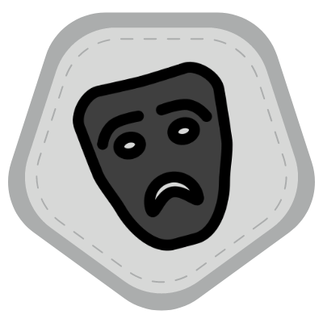
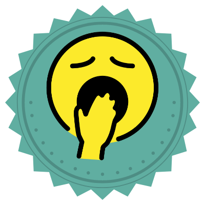
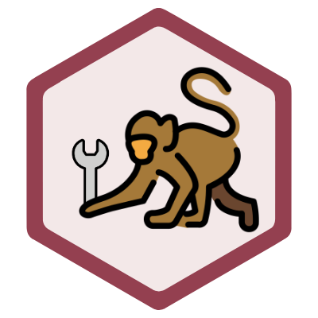
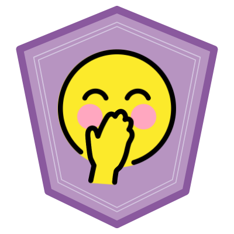
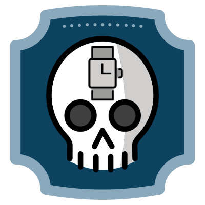
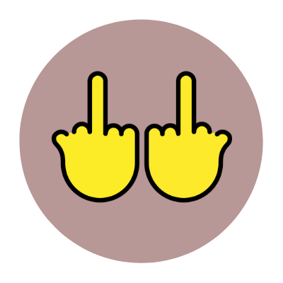
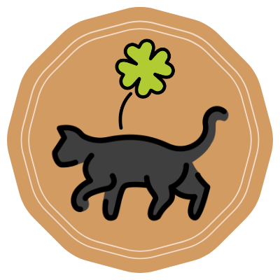

# Rejected GitHub Profile Achievements 😵

A collection listing Achievements that were rejected when creating the GitHub Profile Achievements feature.

This repository attempts to list them all.

## Rejected Achievements

| Title | Badge (prototype) |  Earned by |
| --- | --- | --- |
Vital Contributor |  |	Over 100 issue comments consisting of just "+1" or a thumbs up emoji. 
Sith Lord	        |  |	Wipe out someone else's commits by force pushing to the main branch.
Procrastinator  	|  |	Created a repository with a single "init" commit with just a README.md. Then never touch it for 5 years.
Secret Santa	    |  |	Accidentally commit a secret API key in a public repository.
Monkey Wrench	    |  |	Make a commit directly to the main branch that breaks the build process.
This is Fine      |  |	Over 1,000 open issues on public repositories you own.
Arborist          |  |	Maintain a repository that has at least 150 branches merged but never deleted (keep them around just in case).
Tee Hee         	|  |	In a single "minor cleanup" commit to the main branch, change every line of every file in the repository so that all open Pull Requests are unmergeable.
Patient Skeleton	|  |	Submit a pull request to a public repository that fixes it, but its been open for at least 2 years.
2 FU	            |  |	It's 2022 and you've never enabled 2FA.
Speed Reader    	|  |	Review and approve a pull request that contains over 10,000 lines of code in under 15 seconds.
It's Bad Luck     |  | Merge a commit on a Friday and deploy it with GitHub Actions, then rollback the commit on the weekend.

###### Author's Note
###### This is a joke! PRs welcome
###### Inspired by [Schweinepriester/github-profile-achievements](https://github.com/Schweinepriester/github-profile-achievements)